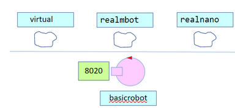

- # BASICROBOT23
	- supporto generico a un qualunque robot
	- 
	- attore generico in grado di colloquiare con qualunque tipologia di robot **tramite un supporto**
	- ci sara file di configurazione in cui specificare il supporto da utilizzare
	- ### CLIENT MULTIPLI
		- il basic robot deve essere ingaggiato da chi lo vuole pilotare per evitare di essere pilotato da piu client diversi
		- #### attore **ENGAGER**
			- riceve le richieste di ingaggio per il virtual robot
			- riceve gli eventi **sonar data** generati dal supporto per poter aggiornare eventuali piloti alieni
			- TODO ricreare boundarywalk
		- 
	-
-