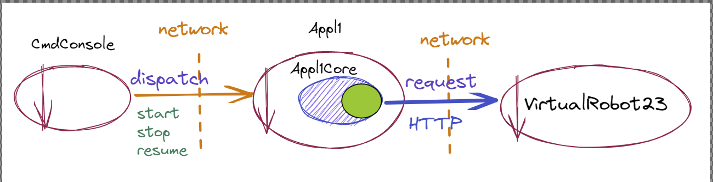

- ## INTRODUZIONE
	- ### ARCHITETTURA LOGICA DI PARTENZA
		- 
	- componenti ottenuti nello step precedente
		- **CmdConsole**
		- **Appl1**
		- **Appl1Core**
	- è inoltre presente una infrastruttura logica sviluppata internamente per la definizione di **attori** si faccia riferimento a [Actors23](file:///home/matteo/universita/iss/isslab23/iss23Material/html/Actors23.html)
- ## REQUISITI
	- Impostare un sistema software che permette ad un utente umano di inviare, mediante una Console, comandi:
		- **start**: per indurre a *VirtualRobot* a percorrare il bordo perimetrale (libero da ostacoli) della stanza rappresentata ne *La scena di WEnv*
		- **stop**: per bloccare il robot
		- **resume**: per riattivare il robot
		- **getPath**: per ottenere dal robot informazioni sul cammino percorso
	- Inoltre è richiesto di:
		- fare in modo che il robot si fermi per un tempo prefissato ( 2sec ) ogni volta che esso viene rilevato da uno dei Sonar cablati nelle pareti della stanza;
		- prefigurare il tempi previsti per lo sviluppo e i tempi effettivi necessari per il completamento del sistema;
		- indicare il modo con cui si ritiene opportuno distribuire il prodotto finale.
- ## ANALISI DEI REQUISITI
	- #### sonar
		- componente della scena (inserire link)
- ## ANALISI DEL PROBLEMA
	- ### I COMANDI
		- la command console ideata nel precedente step soddisfa i requisiti di controllo sopra descritti, pertanto si prevede il riutilizzo per abbattere i costi di produzione
	- ### LOGICA APPLICATIVA
		- La logica applicativa necessita di essere rivista per poter soddisfare il requisito sonar
		- necessario poter eseguire azioni alla ricezione dei messaggi che segnalano l'interazione con il sonar
		-
- ## TEST PLANS
- ## PROGETTO
- ## DEPLOYMENT
-
-
-
-