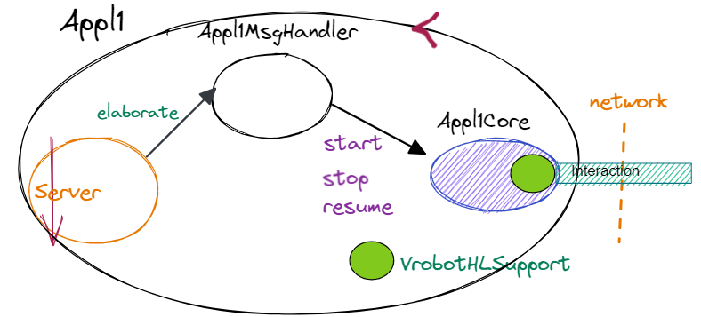
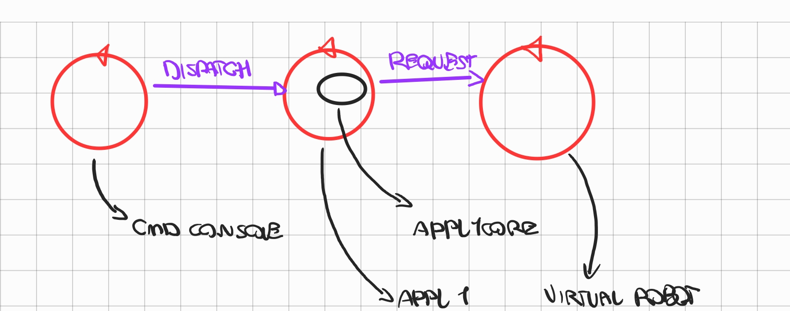
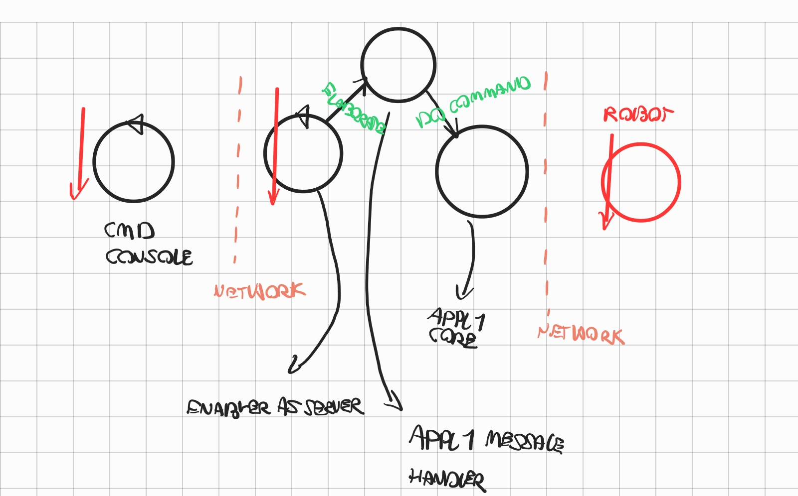

- ## INTRODUZIONE
	- #### componenti ottenuti nello step 2
		- **APPL1CORE**
			- realizza le funzionalità di logica applicativa
		- **COMMAND CONSOLE LOCALE**
			- command console locale al componente Appl1Core
	- #### ARCHITETTURA LOGICA DI ARRIVO SPRINT 2
		- 
- ## REQUISITI
	- In questa nuova fase dello sviluppo, dobbiamo superare le limitazioni che ci siamo imposti in precedenza, la command console deve diventare remota
- ## ANALISI DEI REQUISITI
	- L’applicazione Appl1 viene ora concepito come un ente attivo capace di ricevere messaggi (comandi start/stop/resume) via P e interpretare tali messaggi, convertendoli in comandi a Appl1Core (e di qui a VirtualRobot23).
	- CmdConsole deve diventare un ente attivo che interagisce con un utente umano e che invia comandi ad Appl1 usando il protocollo P
- ## ANALISI DEL PROBLEMA
	- command console
		- la console deve comunicare delle informazioni via rete, non è piu possibile effettuare una procedure call
		- la command console deve essere indipendente dal protocollo di comunicazione utilizzato
	- appl1
		- per evitare di reimplementare la logica applicativa si decide di inglobare il POJO appl1Core in un adapter in grado di ricevere comandi dalla command console
		- l'adapter deve essere indipendente dal protocollo di comunicazione utilizzato
	- NECESSARIO DEFINIRE UN LAYER DI ASTRAZIONE PER IL SUPPORTO DI COMUNICAZIONE
	- ####  supporto di comunicazione
		- astrazione al supporto di comunicazione
			- interfaccia per le funzionalità necessarie al supporto di comunicazione client
				- ```
				  public void forward(  String msg ) throws Exception;
				  public String request(  String msg ) throws Exception;
				  public void reply(  String msg ) throws Exception;
				  public String receiveMsg(  )  throws Exception;
				  public void close( )  throws Exception;
				  ```
			- questa astrazione può essere utilizzata per definire le necessità della comunicazione fra qualunque dei due componenti
	- #### configurazione mediante file
		- sfruttare pattern factory per fornire alle classi la corretta implementazione
	- #### linguaggio di comunicazione
	  id:: 6419b507-442e-4455-8a2e-b521439e7fa5
		- necessario definire in maniera formale il linguaggio di comunicazione tra console e componente Appl1
		- la comunicazione avviene tramite stringhe in formato json
		- `{command:CMD}`
		- `CMD= start|stop|resume`
	- #### TIPOLOGIE DI MESSAGGI
		- la comunicazione tra command console e Appl1  avviene tramite dispatch dato che la command console non necessita di ricevere informazioni da Appl1
		- la comunicazione tra Appl1 e virtual robot avviene tramite request
	- #### ARCHITETTURA LOGICA
		- 
- ### PIANO DI LAVORO
  :LOGBOOK:
  CLOCK: [2023-03-21 Tue 14:36:31]
  :END:
	- #### command console (client)
	  id:: 6419b2af-7f44-44e9-a934-aa788055c0bc
		- sviluppo interfaccia supporto di comunicazione client
		- sviluppo di implementazione pilota su protocollo di esempio (HTTP)
		- sviluppo di factory per interfaccia di comunicazione client
		- sviluppo di classe di integrazione per la comunicazione della command console
	- #### componente Appl1
	  id:: 6419b3e0-6e09-4ab1-afbf-01aa506ecb44
		- sviluppo interfaccia per supporto di comunicazione server
		- sviluppo di implementazione pilota su protocollo di esempio (HTTP)
		- sviluppo di factory per interfaccia di comunicazione server
	- le due fasi  possono essere sviluppate in parallelo da team indipendenti che hanno come vincolo il linguaggio definito in linguaggio di comunicazione
- ### comunicazione con WS
	- la ricezione dei messaggi inviati dal robot tramite ws prevede una semantica asincrona non bloccante
	- necessario definire un contratto con i componenti di alto livello per specificare la semantica delle chiamate
- ## PROGETTAZIONE
	- ### architettura del sistema
		- 
		- Appl1 sfrutta il supporto per ricevere messaggi da cmd console e definisce un handler che viene lanciato alla ricezione dei pacchetti il quale a sua volta esegue le funzionalità offerte da appl1 core
- ## DEPLOYMENT
	- ### Configurazione
		- i componenti Appl1 e Command console necessitano di essere configurati in maniera concorde
			- configurazione statica
			- configurazione determinata a runtime (handshake)
		- la configurazione statica in un primo momento risulta piu immediata e meno time consuming
		-